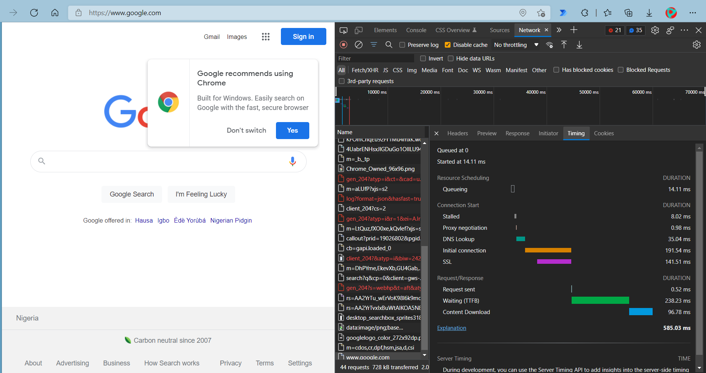

# What happens when you type `https://www.google.com` into your browser and hit ENTER?

With over 80% of the search market share, *Google* is by far the world's largest search engine but have you ever wondered what happens when you type `https://www.google.com` into your browser and hit **ENTER**. From a high-level perspective, what happens would look like this:


There seems to be a lot going on there and it's amazing how it takes only a second or two (give or take) for all of that to happen. We need to take a closer look at the diagram to have a better understanding of what's going on there.

The first thing that happens when you type `https://www.google.com` in the browser and hit ENTER is that the browser checks its DNS (Domain Name Service) cache to see if it can find the IP (Internet Protocol) Address of the hostname (www.google.com). If the browser's DNS doesn't contain the IP address for the hostname, it would have to perform a DNS lookup. This process involves several recursive calls that happen over a TCP connection that would lead to the browser receiving the IP address of the server that.




Once the connection has been established with the server, the browser sends the HTTP request using the HTTP(s) communication rules. The HTTP request would include the request line, several headers and a body. The request line contains the HTTP method, resource path, and the HTTP version to communicate with. The request line for the HTTP request could look like this:

```http
GET / HTTP/2
```

```http
accept: */*
accept-language: en-US,en;q=0.9
sec-ch-ua-arch: "x86"
sec-ch-ua-bitness: "64"
sec-ch-ua-platform: "Windows"
user-agent: Mozilla/5.0 (Windows NT 10.0; Win64; x64) AppleWebKit/537.36 (KHTML, like Gecko) Chrome/97.0.4692.71 Safari/537.36 Edg/97.0.1072.62
```


The headers contain extra information that could help the server identify the client and provide more specific information.

The web server is capable of serving the static application files such as image, video, and audio files as well as dynamic content. The application server would be responsible for running the application.

Websites can get a lot of requests that need to be attended to. These requests can lead to the a web server performing too much work. We could use a load balancer to . The load balancer would be responsible for distributing traffic to the web servers. This would reduce the overall load on a single web server.
